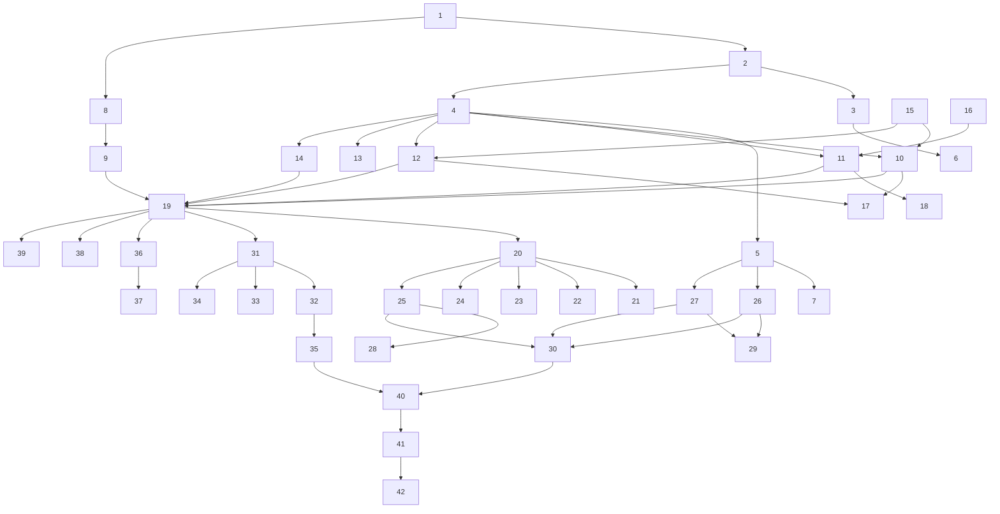

# Implementation Plan: Intelligent IT Support System

## Overview

This implementation plan covers the full build-out of the Intelligent IT Support System across 4 sprints: Foundation (project setup, core API, memory service, CDK), Tool Integration (AD, KB, ServiceNow, diagnostics, identity), Safety & Memory (guardrails configuration, long-term memory), and Frontend & Observability (React chat UI, monitoring, load testing).

## Tasks

### Sprint 1: Foundation

- [ ] 1. Initialize Spring Boot 3.x project with Java 21 and add `spring-ai-bedrock-agentcore-spring-boot-starter` dependency to `pom.xml`
  - [ ] 1.1. Create Maven project structure with Spring Boot parent POM
  - [ ] 1.2. Add Spring AI and AgentCore starter dependencies
  - [ ] 1.3. Configure Java 21 compiler settings

- [ ] 2. Create `application.yml` with Bedrock configuration: model ID (`anthropic.claude-sonnet`), AWS region, guardrail ID placeholder, and AgentCore runtime settings
  - [ ] 2.1. Define Bedrock model and region properties
  - [ ] 2.2. Add guardrail ID and version placeholders
  - [ ] 2.3. Configure AgentCore runtime connection settings

- [ ] 3. Implement `SupportAgentController` with `POST /api/chat` endpoint accepting `ChatRequest(sessionId, userId, message)` and returning `Flux<String>` via SSE
  - [ ] 3.1. Create ChatRequest record
  - [ ] 3.2. Implement streaming SSE endpoint
  - [ ] 3.3. Add error handling and input validation

- [ ] 4. Create `AgentChatClient` Spring bean configuring `ChatClient.builder()` with system prompt defining the IT support persona, available tools, and behavioral constraints
  - [ ] 4.1. Define system prompt with IT support persona
  - [ ] 4.2. Configure tool bindings
  - [ ] 4.3. Set guardrail and model parameters

- [ ] 5. Implement `AgentCoreMemoryService` wrapping the AgentCore Memory SDK with methods: `getConversation(sessionId)`, `saveMessage(sessionId, message)`, `recallPastIssues(userId, limit)`
  - [ ] 5.1. Implement short-term memory operations
  - [ ] 5.2. Implement long-term memory recall
  - [ ] 5.3. Add error handling for memory service failures

- [ ] 6. Write unit tests for `SupportAgentController` using MockMvc (verify streaming response, error handling)

- [ ] 7. Write unit tests for `AgentCoreMemoryService` with mocked SDK client

- [ ] 8. Create CDK stack (`InfraStack.java`) defining AgentCore Runtime resource with JAR deployment configuration, custom domain, and health check endpoint
  - [ ] 8.1. Define AgentCore Runtime construct
  - [ ] 8.2. Configure deployment artifact (JAR)
  - [ ] 8.3. Add health check and custom domain

- [ ] 9. Deploy initial "echo" version to AgentCore Runtime and verify HTTPS endpoint responds with 200 OK

### Sprint 2: Tool Integration

- [ ] 10. Implement `@Tool adLookup(username)` method calling Active Directory via Microsoft Graph API to return account status, lockout state, and last login timestamp

- [ ] 11. Implement `@Tool searchKnowledgeBase(query)` method calling Bedrock Knowledge Bases `RetrieveAndGenerate` API with IT runbook data source ID

- [ ] 12. Implement `@Tool manageTicket(action, ticketId, summary, resolution)` method integrating with ServiceNow REST API (create/update/close incidents)

- [ ] 13. Implement `@Tool checkPermissions(username, resource)` method querying AWS IAM access analyzer or resource policies

- [ ] 14. Implement `@Tool runDiagnostic(command)` method using AgentCore Code Interpreter SDK with 30-second timeout and command allowlist validation
  - [ ] 14.1. Implement command allowlist validation
  - [ ] 14.2. Configure 30-second execution timeout
  - [ ] 14.3. Parse and sanitize diagnostic output

- [ ] 15. Configure AgentCore Identity with OAuth2 client for Active Directory and ServiceNow; implement `IdentityDelegationService` to obtain user-scoped tokens

- [ ] 16. Prepare IT runbook corpus (PDF/Markdown) and ingest into Bedrock Knowledge Base with OpenSearch Serverless vector store

- [ ] 17. Write integration tests for `adLookup` and `manageTicket` using WireMock to simulate AD and ServiceNow APIs

- [ ] 18. Write integration test for `searchKnowledgeBase` using LocalStack S3 with sample KB documents

- [ ] 19. Deploy tools-enabled agent to AgentCore Runtime; verify end-to-end tool calling with a sample VPN issue

### Sprint 3: Safety & Memory

- [ ] 20. Create Bedrock Guardrail via AWS console (or CDK) with PII detection policy: entity types SSN, EMPLOYEE_ID, ADDRESS, PHONE, EMAIL; action MASK

- [ ] 21. Add topic denial policy to guardrail: denied topics — salary, performance_review, legal_advice, investment_recommendation; action BLOCK with redirect message

- [ ] 22. Add content filter policy to guardrail: regex patterns for destructive commands (`rm -rf`, `DROP TABLE`, `FORMAT C:`, `del /f /s`, `shutdown`); action BLOCK

- [ ] 23. Add grounding check policy to guardrail linked to Bedrock Knowledge Base data source; confidence threshold 0.7; action BLOCK ungrounded content

- [ ] 24. Add word filter policy for credential patterns: regex matching API keys (`AKIA...`), connection strings, plaintext password assignments; action MASK

- [ ] 25. Update `application.yml` with final guardrail ID and version; verify guardrails apply to all `ChatClient` invocations automatically

- [ ] 26. Implement long-term memory persistence: after successful resolution, call `memory.saveResolution(userId, ticketId, summary, toolsUsed, resolution)`

- [ ] 27. Implement memory recall: on new session start, call `memory.recallPastIssues(userId, 5)` and inject as context into ChatClient prompt

- [ ] 28. Write guardrail validation test suite: 10 PII inputs (verify masked), 5 destructive commands (verify blocked), 5 off-topic requests (verify denied)

- [ ] 29. Write memory integration test: create session → resolve issue → start new session → verify `recallPastIssues` returns previous resolution

- [ ] 30. Deploy guardrails-enabled agent; run all 5 sample scenarios end-to-end and verify correct behavior

### Sprint 4: Frontend & Observability

- [ ] 31. Scaffold React chat frontend (Vite + TypeScript) with SSE streaming response display, message history, and tool-call status indicators

- [ ] 32. Implement Cognito authentication flow in frontend; pass JWT token to `/api/chat` endpoint for user identification

- [ ] 33. Add UI indicators for agent state: "Checking your account...", "Searching knowledge base...", "Running diagnostic..."

- [ ] 34. Add guardrail intervention UI message: "Some content was filtered for safety" (without revealing what was blocked)

- [ ] 35. Deploy frontend to S3 + CloudFront with HTTPS, CORS configured for AgentCore Runtime endpoint

- [ ] 36. Enable AgentCore Observability: configure full distributed trace capture for all sessions (reasoning steps, tool calls, guardrail events)

- [ ] 37. Create CloudWatch dashboard with metrics: active sessions, response latency (p50/p95/p99), tool call success rate, guardrail intervention count

- [ ] 38. Configure SNS escalation topic: when agent exhausts retry attempts, publish alert to on-call engineer topic

- [ ] 39. Configure AgentCore Evaluations: define 3 eval criteria (accuracy, safety, helpfulness) with sample test conversations

- [ ] 40. Execute end-to-end demo rehearsal: run all 5 sample scenarios (VPN fix, destructive block, memory recall, access request, grounded KB)

- [ ] 41. Run load test with Gatling: 50 concurrent sessions sustained for 5 minutes; verify p95 first-token latency < 3 seconds

- [ ] 42. Final CDK deployment with production settings: WAF rules, custom domain, access logging, alarm thresholds

## Task Dependency Graph

```json
{
  "waves": [
    {"wave": 1, "tasks": [1, 15, 16]},
    {"wave": 2, "tasks": [2, 8]},
    {"wave": 3, "tasks": [3, 4, 9]},
    {"wave": 4, "tasks": [5, 6, 10, 11, 12, 13, 14]},
    {"wave": 5, "tasks": [7, 17, 18, 19]},
    {"wave": 6, "tasks": [20, 26, 27, 31, 36, 38, 39]},
    {"wave": 7, "tasks": [21, 22, 23, 24, 25, 29, 32, 33, 34, 37]},
    {"wave": 8, "tasks": [28, 30, 35]},
    {"wave": 9, "tasks": [40]},
    {"wave": 10, "tasks": [41]},
    {"wave": 11, "tasks": [42]}
  ]
}
```



## Notes

- Sprint 1 establishes the core application skeleton and deployment pipeline. All subsequent sprints depend on a working AgentCore Runtime deployment.
- Sprint 2 tools can be developed in parallel once the ChatClient is configured (Task 4).
- Sprint 3 guardrail policies (Tasks 20-24) can be configured in parallel since they are independent policies on the same guardrail resource.
- Sprint 4 frontend and observability work can begin as soon as the API is deployed with tools (Task 19).
- Integration tests (Tasks 17, 18) use WireMock and LocalStack to avoid external service dependencies in CI.
- The load test (Task 41) should be run against a staging environment that mirrors production configuration.
